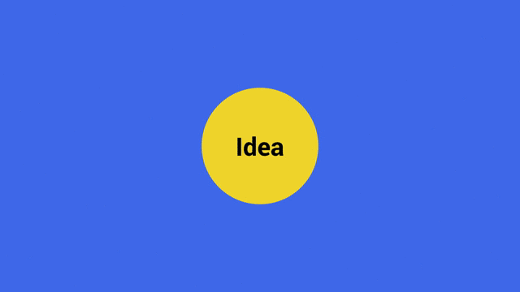
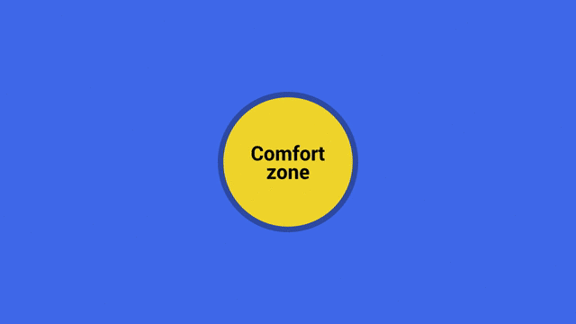
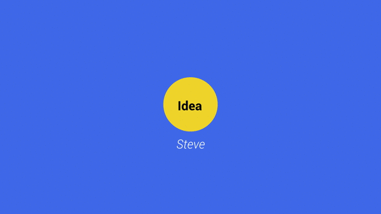
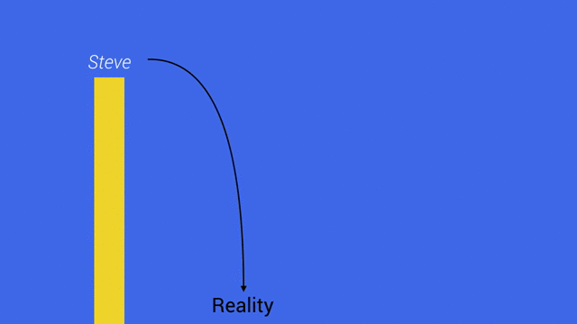
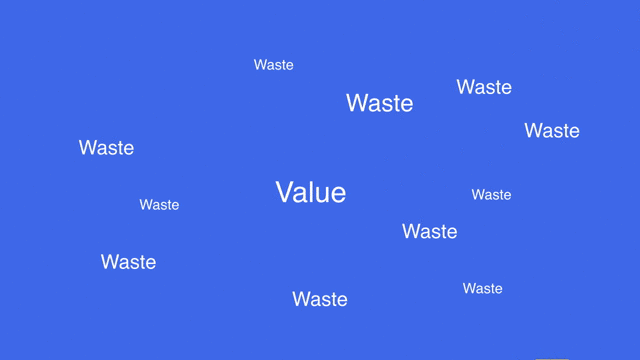
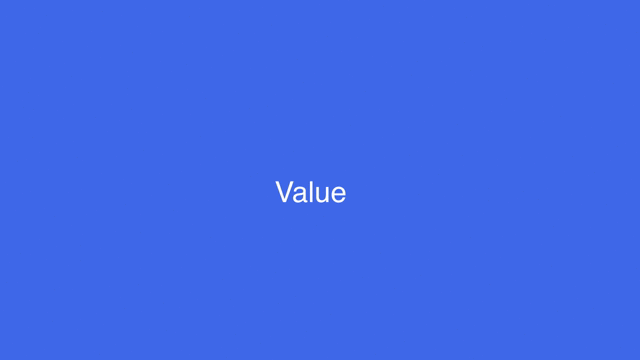
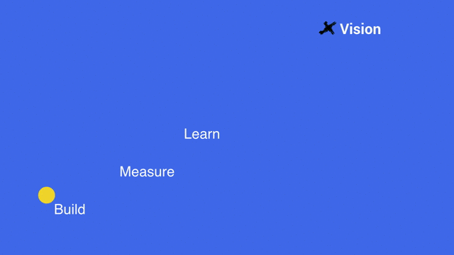

### DRAFT

----

# Transformez une bonne idée en un produit couronné de succès

Ce 15 octobre, j'intervenais à l'école d'ingénieur [Epita](http://www.epita.fr/). Je présentais aux étudiants ce qu'il se cache derrière les termes _Lean_ et _Agile_.

## De l'idée au produit

Des produits se trouvent tout autour de vous. A l'origine : une idée.
L'une des activités d'une start-up est justement de transformer des idées en produits.
Mais comment s'y prend-elle ?

## Une aventure en 3 actes

Aujourd'hui nous allons suivre l'aventure de Steve. Lui aussi, il a une idée.
Ce héros, c'est peut-être vous.

Vous verrez à travers cette aventure comment les principes Lean & Agile aident à valider et  affiner votre idée. Vous découvrirez qu'ils vous aident à lancer votre produit plus rapidement, un produit qui correspond mieux aux attentes du marché.

En bref, vous réaliserez je l'espère que les principes Lean & Agile contribuent au succès de votre futur produit.

Cette aventure se déroule en 3 actes : 

- Vision
- Strategie
- Produit

<header>
<h1>Acte 1 - La vision</h1>
</header>

## Sortez de votre zone de confort !

Aujourd'hui, notre héros a une idée. Il est déjà en train de la "coder". C'est l'occasion de tester le super framework X. Il code, il test, il expérimente. Il s'amuse.

Il est dans sa **sa zone de confort**.

Il commande un nom de domaine chez son prestataire préféré. Sur son dashboard, il voit déjà 38 noms de domaine. 38 !

38 projets, 38 idées, mais qu'il n'a jamais vraiment lancées. Pourquoi ?

Il dit souvent "qu'il n'a pas le temps". Ses amis pensent qu'il a surtout peur de supprimer un peu de bruit dans sa vie, de trouver ce temps et de partir à l'aventure. Partir à l'aventure, c'est effectivement effrayant.

Aujourd'hui, un nouveau produit fait le "buzz" sur internet. Il avait eu cette idée il y a quelques années ! Il est frustré.

Simplement _penser_ à une idée n'est pas suffisant. Elle reste un fragment caché dans votre imagination.

## Projetez votre idée

Notre héros est fan d'Elon Musk, le créateur de Paypal.
Après Paypal, Elon Musk a créé SpaceX, Tesla, SolarCity.

SpaceX, par exemple, a pour vision de _"révolutionner le coût des voyages dans l'espace et de coloniser Mars"_. Rien que ça.

Votre vision projette votre idée dans le monde qui nous autour. Elle détermine quel impact aura votre idée sur le monde.

> Making the world a better place!

« Rendre le monde meilleur », aussi naïve soit cette expression commune, elle vous invite à projeter votre idée dans le monde réel.

La première étape de votre aventure : **avoir une vision**.

Sans une vision, vous naviguez à vu, au gré du vent. Pire encore, si vous voyagez accompagné, votre bateau fera du sur-place si chacun navigue dans des directions différentes.

Que ce soit une idée toute simple ou un projet fou comme celui d'Elon Musk, comment maintenir un cap vers sa vision ?

<header>
<h1>Acte 2 - La stratégie</h1>
</header>

## Ne tombez pas de trop haut

Steve sait combien il doit être prudent. Il connait l'histoire de son cousin. Celui-ci, après une idée, réalise un cahier des charges. Il fait développer le produit par une agence. Résultat promis dans 6 mois, livré finalement au bout de 9 mois après de nombreuse erreurs et corrections.

Malheureusement, en quelques mois :

- le marché avait évolué
- son idée était devenue plus mature
- et surtout, il avait appris de nombreuses choses 

Mais c'était trop tard. Faute de temps et d'argent restant pour pouvoir réaliser les nombreux ajustements nécessaires, l'aventure s'est arrêtée là.

Dans un projet qui ne trouve pas un envole rapidement, l'équipe risquent de se démotiver, les pressions financières et familiales risquent de reprendre le dessus.

Vous devez donc évitez d'escalader une marche trop haute avant de confronter votre produit à la réalité du marché.

Steve ne veut pas se retrouver en haut d'une telle marche. Il sait que la chute serait fatale.

## Faites de petits sauts

Il vaut mieux tomber souvent d'une petite hauteur, que rarement et ne pouvoir se relever.

Elon Musk et SpaceX ont lancé des fusées à trois reprises. Elles ont à chaque fois explosé avant d'arriver en orbite. Malgré les échecs, ils se sont relevés et ils ont **appris de leurs erreurs**. Et le quatrième lancement a été un succès.

L'idée n'est qu'un déclencheur.

Steve se dit donc :

> Je vais **penser grand**, mais **débuter petit**.

## Supprimez les gaspillages

_Lean Startup_ a été influencé en particulier par le _Lean Manufacturing_.

Le Lean Manufacturing, dans l'industrie, s'efforce de réduire les gaspillages :

- la surproduction,
- les attentes,
- les mouvements inutiles
- les stocks (productifs ou administratifs) 
- ...

Elle invite à se concentrer sur ce qui apporte de la valeur.
La _valeur_ se situe dans les éléments qui apportent un **avantage aux clients**. Sinon, il s'agit de gaspillage. 

Une start-up évolue jour après jour en faisant face à d'extrêmes incertitudes.

Dans ces conditions, et c'est au coeur de la méthodologie **Lean Startup**, la start-up réalise des expérimentations qui testent régulièrement sa stratégie. Elle identifie ce qui fonctionne, **la valeur**, et supprime tout le reste, **les gaspillages**.

Une start-up n'a pas pour seul objectif de livrer des produits satisfaisants aux clients. Elle cherche surtout au départ à grandir et construire une activité **viable à long terme**.

Ainsi, le _Lean Startup_ s'adapte au monde des start-ups et s'efforce :

- de proposer de la valeur au client
- mais aussi d'avoir une croissance et d'être viable

Alors Steve se demande chaque jour :

> Mes activités aujourd'hui apporte-t-elle de la valeur à mes clients, de la croissance à mon entreprise ?
> Il y a-t-il des efforts qui sont au contraire que pur gaspillage ?

## Expérimentez, validez

Alors pour réduire ces gaspillages, dans une démarche _Lean Startup_, Steve expérimente en suivant une méthode scientifique : 

- 1/ Partir d'hypotheses :
	- de proposition de valeur
	- de croissance 
- 2/ Confronter ces hypothèse à des éléments concrets 

Une experimentation est plus concrète qu'une prévision de marché ou un business plan.

## Construisez un produit minimum viable

Cet objet **concret** est porté par le MVP (Minimum Viable Product, ou produit minimum viable)

Voici quelques exemples de **produits minimum viable** :

- l'email MVP et le blog MVP : ils peuvent se gérer de manière asynchrone et manuelle. Et ils permettent déjà de créer des habitudes clients.
- la video MVP : elle valide un produit relevant un grand challenge technique. Elle est utile quand le client ne sait pas décrire exactement ce qu'il souhaite ou quand il est difficile de lui demander. Et permet de présenter et de valider un concept résolument nouveau.

## Pivotez quand cela est nécessaire

Parfois, avec les leçons tirées lors de ces experimentations, il est nécessaire de **pivoter**. Voici quelques exemples de pivot :

- une fonctionnalité du produit devient le produit en lui-même
- ou, au contraire, le produit initial se retrouve au coeur d'un produit plus large
- le type de client visé est modifié
- ou bien, on conserve ce segment client mais on résout un autre problème, plus pertinent pour celui-ci
- le revenu est capté par un autre modèle
- la plateforme ou les technologies choisies pour porter son produit sont remises en question

Grâce au MVP, Steve valide ou réfute ses hypothèses de valeur et de croissance. Il acquière une connaissance. L'acquisition de connaissances a malheureusement mauvaise réputation : on ne peut en effet ni la vendre, ni vraiment la restituer aux investisseurs.

Pourtant, apprendre et tirer des leçons de ses erreurs, est l'une des clefs de la progression d'une start-up.

<header>
<h1>Acte 3 - Le produit</h1>
</header>

Dans l'acte _stratégie_, nous avons vu des changements, plutôt rares : les pivots.

Dans cet acte _produit_ nous allons réaliser des changements bien plus fréquents, de type "optimisations".

Steve, notre héros, maitrise aujourd'hui mieux son marché, comprend les attentes et les concurrents. Il a déjà ses premiers fans, les _early adopters_ et ses premiere partenaires.
        
Pour accélérer sa croissance, il crée un équipe complète de développeurs.

## Accélérez

### Le manifest agile pour le développement Agile de logiciels

Voici les 4 principes agiles:

> Nous reconnaissons la valeur des seconds éléments, mais privilégions les premiers :
> 
> - Les individus et leurs interactions plus que les processus et les outils.
> - Du logiciel qui fonctionne plus qu’une documentation exhaustive.
> - La collaboration avec les clients plus que la négociation contractuelle.
> - L’adaptation au changement plus que le suivi d’un plan.

Steve se rend compte qu'il jusqu'à présent privilégié _l'autre coté_ : processus, outils, spécifications, pas de collaboration étroite avec le client...

Pour améliorer le développement avec l'équipe, il leur propose d'adopter SCRUM.

Voici ce qu'il s'est passé.

#### SPRINT

> - Les individus et leurs interactions plus que les processus et les outils

Il responsabilise son équipe, en particulier en lui demandant de s'engager sur un objectif clair pour les 3 prochaines semaines qui constitues le *sprint*.

Il accorde aussi plus de confiance à son équipe.

#### GROOMING

> - La collaboration avec les clients plus que la négociation contractuelle.

Steve collabore davantage avec l'équipe de développement et prend en compte les remarques. Les clients sont parfois invités pour participer à la discussion.

----------------

#### SPRINT, DEV, DEMO

> - Du logiciel qui fonctionne plus qu’une documentation exhaustive.

----------------

#### RETROSPECTIVE & NEXT SPRINT

------------------

-----------------

Cela fait maintenant trois ans qu'il développe son produit.

Il a appris combien il est important de :

- lancer le produit le plus vite possible
- rechercher le feedback et de savoir se remettre en question
- faire preuve de résilience ("tomber souvent et pour pouvoir se relever"),
- ne pas s’acharner si cela ne vaut pas le coup et pivoter

# Conclusion 

Si vous êtes entrepreneur, que vous avez vos rêves, votre idée, n'oubliez pas que le développement client est aussi important, si ce n'est plus important, que le développement logiciel. Développement client ET développement logiciel. Rencontrez vos futurs clients très tôt, comprenez le marché, les attentes, expérimentez, mesurez, validez.

Si vous êtes ingénieur logiciel, dans une petite ou grande entreprise, prenez du recul, soyez toujours vigilant, proposez des méthodes qui amélioreront la communication et la productivité de votre équipe. Prônez des valeurs comme la confiance, la transparence.

Dans tous les cas, contribuez activement à la réussite du projet de votre entreprise. Soyez ce héros, vivez cette experience, devenez mentor à votre tour.
